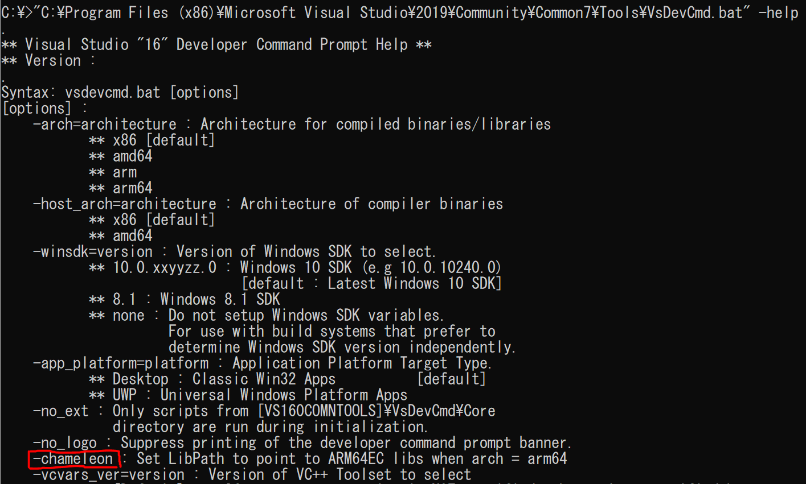

# Project Chameleon

## About this project

CHPE stands for Compiled Hybrid PE, which contains both x86 (or x86\_64) code and Arm64 code.
The special PE files are distributed for reducing the amount of JIT binary translation by `xtajit.dll` (or `xtajit64.dll`).
You can find the more detailed explanations at [Cylance Research Team's Blog](https://blogs.blackberry.com/en/2019/09/teardown-windows-10-on-arm-x86-emulation) and ["WoW64 internals ...re-discovering Heaven's Gate on ARM."](https://wbenny.github.io/2018/11/04/wow64-internals.html)

These PE files were previously located only at `%SystemRoot%\SysChpe32`.
However, after the introduction of x64 emulation feature, much of the DLLs at `%SystemRoot%\System32` have become a new type of CHPE called CHPEV2 ARM64EC and ARM64X.

This project collects reverse engineering results of CHPEV2.

## Contents

- [Reverse engineering results of a new relocation entry, `IMAGE_DYNAIC_RELOCATION_ARM64X` in CHPEV2 files](https://ffri.github.io/ProjectChameleon/new_reloc_chpev2/).
- [Ghidra scripts to analyze CHPEV2 files](./ghidra_scripts)
- [A Python script to find CHPE and CHPEV2 files in Windows 10/11 on ARM](./chpe_scanner)
- [PoC code and tools for Hybrid Auxiliary IAT hooking](./hybrid_aux_iat)
- [A Python script for analyzing and modifying `IMAGE_DYNAMIC_RELOCATION_ARM64X`](./arm64x_reloc_tools)

## Why "Chameleon" ?

This is because "VsDevCmd.bat" has the "-chameleon" compile flag for building CHPEV2 ARM64EC files.

## Author

Koh M. Nakagawa. &copy; FFRI Security, Inc. 2021

## License

[Apache version 2.0](./LICENSE)

